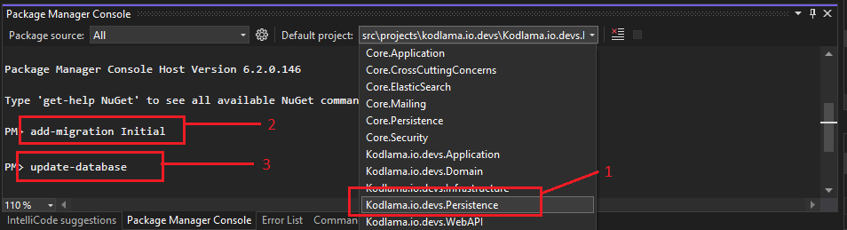

# Kodlama.io.Devs

<h2> Startup </h2>
<h3> ⬇️ Configure admin user in appsettings.json ⬇️ </h3>

```json
"AdminUser": {
    "FirstName": "admin_first_name",
    "LastName": "admin_last_name",
    "Email": "admin_email@hotmail.com",
    "Password": "admin_password"
  }
```
<hr>
<h3> ⬇️ Configure connection string in appsettings.json ⬇️ </h3>

```json
"ConnectionStrings": {
    "SqlServer": "Server=DESKTOP-HVLQH67\\SQLEXPRESS;Database=KodlamaDevDb;integrated security=true;"
  }
```
<h3> ⬇️ Create migration and create database in package manager console ⬇️ </h3>



<h2>
<a href="https://documenter.getpostman.com/view/17832908/VUxSrQjV">Postman Documentation</a>
</h2>
